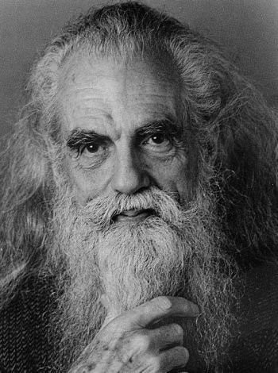

//TODO: Ben Gardiner

Rewritten from: https://www.linkedin.com/pulse/ben-gardiner-aids-info-bbs-sysadmin-john-west/

Ben Gardiner, AIDS INFO BBS Sysadmin

After my mother’s father returned from World War II Europe, he quickly had four children before determining that he was gay. This had brought out some abusive alcoholic tendencies and he had to leave the family to join AA and a monastery for a time. Much of the family was embarrassed, resenting and discarding him for this. I was lucky enough to live with him for a few months in 2000.

After he found himself, he was a truck driver and then ended up living in the Castro in San Francisco. He avoided alcohol for the remainder of his life. We might not appreciate now how different things were in the 70s, especially for people that did not conform.

Ben died of heart failure shortly after my first son arrived. Turnout at his funeral was amazing. I was responsible for his possessions, which was an educational experience. I had known him well but learned a great deal more about what was important to him by sifting through his things.

One item was a box of whistles. While people from the GLBT History Society (an old reference - I believe that LGBTQIA+ is current) were there to collect a bullhorn and some other items that were somehow significant, they explained that he had handed them out in the early days so that people could reduce the potential of being seriously bashed on the street.

If I understand correctly, Ben knew Harvey Milk well, and they spent time at each other’s homes, performing their civic duties to organize resistance.

This was around the time of the start of the AIDS crisis. Ben would take patients into his home and provide hospice care until they died. He was quite involved with his local community. He was also a sysadmin for AIDS INFO BBS and Queernet. Another item from his apartment was a bank of huge modems nailed to a plywood board. I wish that I had snapped a photo. The Altos box of which I posted a photo recently (plus most of its contents) came from his home. He was from the depression era, which had made him a bit of a hoarder.

Towards the end of his life, Ben was working on a project called Talking Portraits, which was a way for people to provide some type of record of their lives, using video. One or more partners in this effort captured some content about Ben. It's a worthwhile five minutes, but unfortunately I cannot find it now.

Ben was also a model and an actor. During college, before he and I had reconnected, I remember coming across a picture of him in a tech magazine. It was some kind of vault software and his was the face of time. Upadate: I think the name of the product was Chronos or Kronos or something similar. He was proud of the few commercials in which he appeared, as well as his small part in The Doors movie. I always liked watching him taking some kids’ weed and rolling a joint in The Tripper.

He was an incredible man.

Unfortunately, I can’t find his talking portrait or the footage of him marching behind Milk, both of which I believe are on youtube somewhere. It’s just too hard to get through all of the noise there these days.

https://www.imdb.com/name/nm2012800/ (Ben Gardiner)

https://www.imdb.com/title/tt0760187/ (The Tripper)

https://www.glbthistory.org/ (GLBT History Society)

https://en.wikipedia.org/wiki/Harvey_Milk (Harvey Milk)

https://www.sfgate.com/bayarea/article/Ben-Gardiner-dies-gay-rights-activist-actor-3271651.php

https://paganpressbooks.com/jpl/BEN.HTM

https://paganpressbooks.com/jpl/BEN-OBIT.HTM

https://paganpressbooks.com/jpl/BEN-TAW.HTM

There is also an audio recording, I think of an interview for radio, out there somewhere.

This is one of his modeling headshots and may actually be the image that I saw in the magazine. Grandfun, I miss you.

No alt text provided for this image
Update: I found the Talking Portrait thing.

https://www.youtube.com/watch?v=emWm7uSznug

Also found this:

https://archive.org/details/bbsdocumentary-interview-gardiner-2002-07

And here's a short one about Milk that includes the clip that I had mentioned:

https://www.youtube.com/watch?v=eXUc2CpioDA

I just remembered that his middle name was Outram. When I was living in Singapore, I found Outram Park MRT to be one of the stations nearest to my office. My life seems to be full of weird luck and little coincidences like that, as if someone is planning it from above and all I have to do is walk down the right path.

2.Feb.2021: One of my other awesome relatives just sent me this link:

How a 1980s AIDS Support Group Changed The Internet Forever | by Michael Waters | Dec, 2020 | OneZero (medium.com)